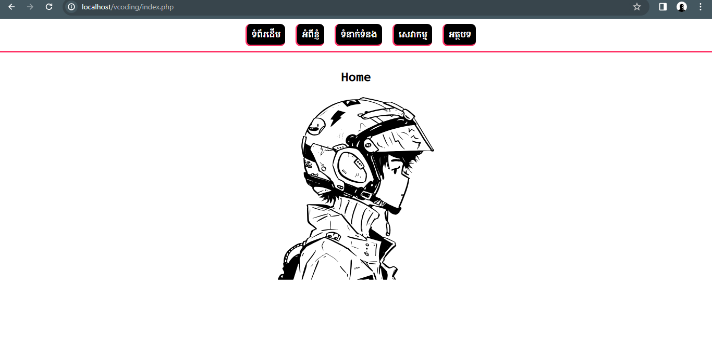

# Active Nav Link Indicator using PHP

@VS9DAY


```html
<!DOCTYPE html>
<html lang="en">
<head>
    <meta charset="UTF-8">
    <meta name="viewport" content="width=device-width, initial-scale=1.0">
    <title>V/</title>
    <link rel="stylesheet" href="CSS/styles.css">
</head>
<body>

  <?php include_once('menu.php'); ?>

  <h2>Home <br>
    
  </h2>
</body>
</html>
